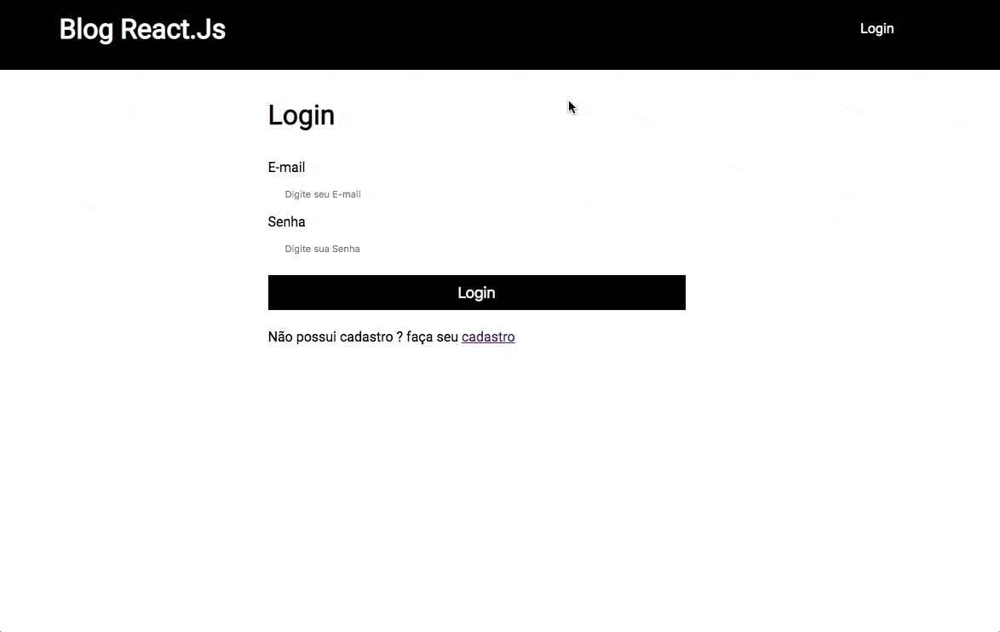

# Curso React do Zero ao Avançado 
https://www.udemy.com/course/curso-reactjs/ <br />

Exercícios e projetos realizados durante o curso<br/>

## Índice

- **[Exercícios com React](#exerc%C3%ADcios-com-React)**
- **[Exercícios com Firebase](#exerc%C3%ADcios-com-Firebase)**
- **[Projeto sistema de login e cadastro de postagem](#Projeto-sistema-de-login-e-cadastro-de-postagem)**
- **[Projeto busca de repositiorios no Github](#Projeto-busca-de-repositiorios-no-Github)**

## Exercícios com React
Praticando os conceitos do reactjs.<br/>
Arquivos: [exercicos-react](https://github.com/carloswilliamds/curso-react-zero-ao-avancado-udemy/tree/master/exercicos-react)
```javascript
import React, {Component} from 'react';
```


## Exercícios com Firebase
Testes com o banco de dados Firebase.<br />
Arquivos: [firebase](https://github.com/carloswilliamds/curso-react-zero-ao-avancado-udemy/tree/master/exercicos-react)


## Projeto sistema de login e cadastro de postagem
Projeto utilizando React e Firebase.<br />
Arquivos: [blog-react-and-firebase](https://github.com/carloswilliamds/curso-react-zero-ao-avancado-udemy/tree/master/exercicos-react)

#### Cadastro e Login


#### Nova postagem


## Projeto busca de repositiorios no Github
Projeto utilizando React Hooks, React Router, Styled Components.<br />
Arquivos: [repositiorio-app](https://github.com/carloswilliamds/curso-react-zero-ao-avancado-udemy/tree/master/exercicos-react)


